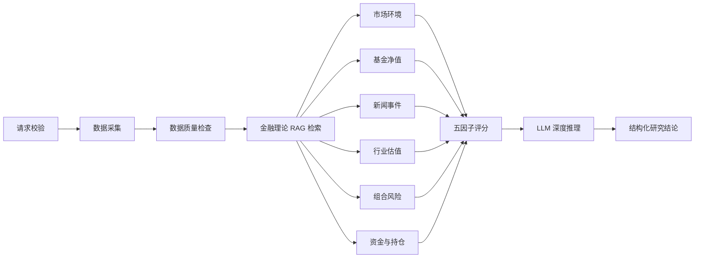

# 观澜（Guanlan）多源基金投研智能体

> 基于 **LangGraph + Python FastMCP + React** 构建的中国公募基金研究系统，将真实公开行情、基金持仓、行业估值、风险指标、金融理论知识与大模型推理整合为可追溯的投研工作流。


观澜面向基金研究与组合跟踪场景，强调 **真实来源、确定性计算、证据分层和人机协同**。系统可以查询单只基金，也可以维护 4 只持仓基金，对市场、净值、新闻、估值、风险及资金与持仓变化进行联合分析，并输出明确的 **买入 / 持有 / 减仓 / 卖出** 研究建议。系统不会自动执行交易，所有结论仅用于研究辅助。


## 核心能力

| 模块 | 能力 |
| --- | --- |
| 市场数据监控 | 根据交易时段自动切换 A 股或美股市场，展示指数涨跌、成交额、市场资金流、北向资金与板块资金流。 |
| 基金净值追踪 | 支持基金代码或名称搜索、4 只持仓基金自定义、单位净值、区间收益、同类基准及公开持仓追踪。 |
| 资金与持仓变化 | 对比基金定期报告中的持仓权重变化，并展示重仓股票的最新行情；明确区分披露事实与模型推断。 |
| 智能新闻采集 | 使用关键词和持仓实体进行预筛，结合模型分析近期公告与资讯，保留日期、来源和信息优先级。 |
| 行业估值分析 | 基于基金公开持仓映射行业，分析 PE、PB、历史分位与行业估值状态，并标记披露滞后风险。 |
| 组合风险管理 | 计算年化波动率、最大回撤、相关性等指标，对 4 只持仓基金进行统一风险观察。 |
| 五因子信号引擎 | 综合市场、估值、动量、风险、质量与资金五类因子，生成确定性评分，并根据数据质量抑制强信号。 |
| 智能分析与对话 | 结合最新基金数据、近期信息、公开持仓与金融 RAG 生成分析，支持围绕当前结论连续追问。 |
| 投资偏好记忆 | 在浏览器保存风险偏好、投资周期、买卖方式和常查板块，用于调整建议的仓位、批次与观察周期。 |

## Agent 工作流



- 使用 **LangGraph StateGraph** 编排有状态工作流，以 `TypedDict` 管理共享 State。
- 使用 **Conditional Edge** 在请求或数据采集失败时短路，避免无效节点继续执行。
- 使用 **Fan-out / Fan-in** 并行完成六类分析，再汇聚到评分和推理节点。
- 默认使用 `InMemorySaver` 保存执行状态，生产环境可替换为 SQLite 或 PostgreSQL Checkpointer。
- 关键数值由确定性代码计算，LLM 只负责证据组织、逻辑解释和操作建议生成。

## 五因子评分

五因子采用等权聚合，每项权重为 `20%`：

| 因子 | 主要输入 |
| --- | --- |
| 市场因子 | 指数涨跌、上涨与下跌家数、市场环境 |
| 估值因子 | PE / PB、历史估值分位 |
| 动量因子 | 20 日与 60 日区间收益 |
| 风险因子 | 年化波动率、最大回撤 |
| 质量与资金因子 | 基金经理任期、跟踪误差、基金份额变化 |

评分引擎先生成确定性分数，再将市场、估值、动量、风险、资金持仓及数据质量一并交给模型解释。当数据质量低于阈值时，系统会自动抑制强信号，避免 LLM 直接计算或放大不可靠指标。

## MCP 与数据源

Node.js 服务通过官方 **MCP SDK** 的 `StdioClientTransport` 管理 Python MCP 子进程，并复用已建立的连接。Python 工具参数由 **FastMCP** 暴露为 JSON Schema；服务端同时实现请求超时、分层 TTL 缓存和数据源降级。

| MCP 服务 | 用途 | 是否需要密钥 |
| --- | --- | --- |
| 东方财富 MCP | 基金搜索、净值、持仓、股票与指数行情、资金流、北向资金、行业估值 | 否 |
| 同花顺 iFinD MCP | 授权用户的实时行情与高频数据 | 是 |
| 支付宝基金适配器 | 对接蚂蚁财富或合作机构提供的已授权基金接口 | 是 |
| 金融 RAG MCP | 金融理论检索、索引重建、知识库状态查询 | 否 |

东方财富数据来自公开接口，基金持仓以最近一次定期报告为准，不代表基金经理盘中实时交易。支付宝 App 私有数据不会被抓取，只有获得正式接口授权后才会启用对应适配器。

## 金融 RAG

本地知识库位于 `knowledge/finance-theory/`，覆盖基金分析、组合风险、估值、宏观政策、多因子投资与行为周期。

- 按标题和段落切分，单块上限 `900` 字符，重叠 `120` 字符。
- 使用中文 Uni/Bi/Tri-gram 构建 `768` 维哈希向量，无需额外 Embedding API。
- 采用 `0.72 × 余弦相似度 + 0.28 × 关键词覆盖率` 进行混合召回。
- 使用 **SQLite WAL** 存储索引，并通过 **SHA-256** 内容哈希自动判断是否重建。
- 检索结果携带 Citation，并以“通用理论”身份注入模型，不替代基金最新事实。

```powershell
cd web
npm.cmd run rag:build
npm.cmd run rag:status
```

## 智能分析与长期记忆

模型层使用 OpenAI `v1/chat/completions` 兼容协议，可以连接 OpenAI 官方服务或第三方中转站。每次分析都会组合：

1. 基金最新净值、收益和风险指标；
2. 公开持仓、行业配置与股票行情；
3. 近期公告和相关新闻；
4. 五因子评分与数据质量；
5. 金融理论 RAG 检索结果；
6. 用户的风险偏好、投资周期、买卖方式和常查板块。

模型必须在 **买入、持有、减仓、卖出** 中选择一个动作，并说明相对仓位、分批次数、观察周期、触发条件和失效条件。偏好与风险冲突时以风险约束优先。

当前长期记忆保存在浏览器 `localStorage`，不会保存 API Key，也不会在不同设备之间自动同步。

## 技术架构

| 层级 | 技术 |
| --- | --- |
| Agent 编排 | Python 3.10、LangGraph StateGraph、TypedDict、Checkpointer |
| 工具协议 | Python FastMCP、MCP Stdio、官方 Node.js MCP SDK |
| 数据与计算 | 东方财富公开数据、可选 iFinD / 支付宝授权接口、确定性量化指标 |
| 模型服务 | OpenAI Chat Completions 兼容协议、第三方中转站支持 |
| RAG | SQLite WAL、哈希向量、关键词与向量混合召回 |
| 服务端 | Node.js HTTP Server、连接复用、超时控制、TTL 缓存、限流 |
| 前端 | React 19、TypeScript 5、Vite 8、响应式投研工作台 |

## 项目结构

```text
funding/
├─ src/fund_agent/          # LangGraph 状态、节点、数据提供器与量化计算
├─ knowledge/finance-theory # 金融理论 Markdown 语料
├─ data/rag/                # 自动生成的 SQLite RAG 索引
├─ web/
│  ├─ src/                  # React 前端
│  ├─ server/               # Node.js API、模型协议与 MCP 客户端
│  ├─ mcp/                  # 东方财富、iFinD、支付宝与 RAG MCP 服务
│  └─ tests/                # Web、MCP、模型协议测试
├─ tests/                   # LangGraph、RAG 与量化计算测试
├─ .env.example             # 全部环境变量模板
└─ pyproject.toml
```

## 快速启动

### 1. 环境要求

- Anaconda / Miniconda，Python `3.10`
- Node.js `>= 22.13`
- npm

### 2. 安装依赖

```powershell
cd E:\PythonLearn\Agent\funding
conda activate Python_310
python -m pip install -e .
python -m pip install -r web\requirements-mcp.txt

cd web
npm.cmd install
```

### 3. 配置环境变量

所有环境变量统一放在项目根目录 `.env`：

```powershell
cd E:\PythonLearn\Agent\funding
if (-not (Test-Path .env)) { Copy-Item .env.example .env }
```

启用智能分析至少需要填写：

```env
OPENAI_API_KEY=你的服务端密钥
OPENAI_BASE_URL=https://api.openai.com/v1
OPENAI_MODEL=gpt-5.4-mini
MCP_PYTHON_EXECUTABLE=你的Python_310环境python.exe绝对路径
```

使用第三方中转站时，将 `OPENAI_BASE_URL` 和 `OPENAI_MODEL` 替换为服务商提供的地址与模型名。真实密钥只允许写入本地 `.env`，不要提交到 Git。

### 4. 开发模式

```powershell
cd E:\PythonLearn\Agent\funding\web
npm.cmd run dev
```

- 前端默认地址：`http://localhost:5173`
- API 默认地址：`http://localhost:8787`
- 如果端口被占用，请先结束旧进程，或修改根目录 `.env` 中的 `PORT`。

### 5. 生产模式

```powershell
cd E:\PythonLearn\Agent\funding\web
npm.cmd run build
npm.cmd run start
```

生产服务监听 `0.0.0.0:8787`，可通过服务器防火墙、反向代理和域名对外发布。跨域部署时，在根目录 `.env` 的 `WEB_TRUSTED_ORIGINS` 中填写允许访问的前端域名。

### 6. 单独运行 LangGraph Agent

```powershell
cd E:\PythonLearn\Agent\funding
conda activate Python_310
$env:PYTHONPATH="$PWD\src"
python -m fund_agent.cli 510300 --report-type on_demand
```

## 测试

```powershell
# Python Agent、RAG 与量化计算
cd E:\PythonLearn\Agent\funding
conda activate Python_310
$env:PYTHONPATH="$PWD\src"
python -m unittest discover -s tests -v

# React、Node API、MCP 与 OpenAI 兼容协议
cd web
npm.cmd run typecheck
npm.cmd run lint
npm.cmd test
```

## 安全与边界

- `.env`、API Key、Access Token 和本地 RAG 数据库不得提交到仓库。
- 模型输入中的新闻、知识库和历史对话均按不可信数据处理，不能修改系统安全规则。
- 估值与持仓受基金披露频率影响，股票实时行情不等于基金实时持仓。
- 操作建议是研究结论，不构成收益承诺，也不会自动执行任何交易。
